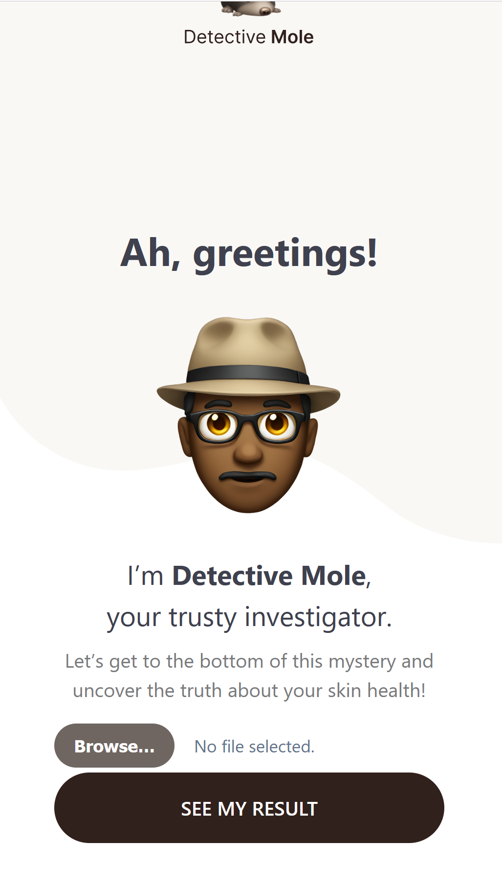
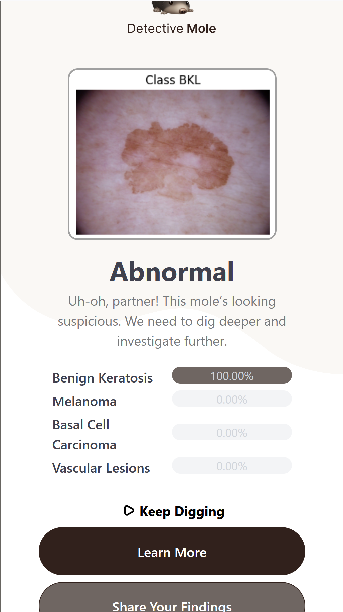

# Detective Mole

Detective Mole is a playful yet powerful image classifier that helps identify different types of skin conditions from photos of moles. Powered by a trained TensorFlow model, this web app offers immediate visual feedback and diagnosis insight in an engaging, friendly tone.

This project is for demonstration purposes only and not intended for medical diagnosis.

## Features

- Upload skin lesion images and receive instant classification.
- Detects various skin conditions like Benign Keratosis, Melanoma, and more.
- Interactive results screen with breakdown and next steps.
- Clean, Streamlit-powered user interface.

## Demo

### Landing Page


### Result Page


## Tech Stack

- Python · TensorFlow · Streamlit · PIL · NumPy
- UI mockups generated using emoji assets for engaging presentation
Installation

```bash
pip install -r requirements.txt
streamlit run app.py
